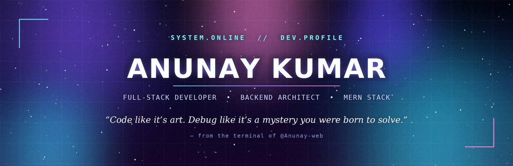
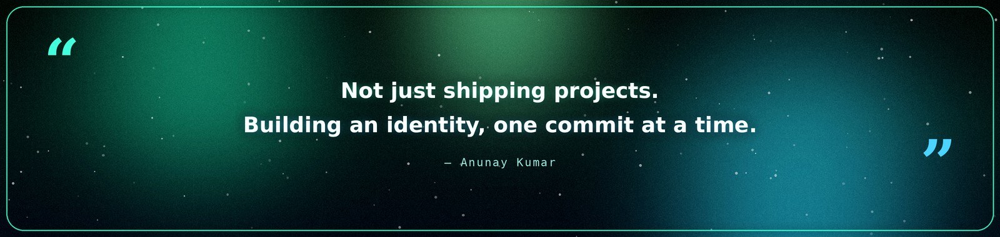

<div align="center">




<br/>


</div>

<br/>

## 👤 whoami

```yaml
name: Anunay Kumar
role: Full-Stack Developer | Backend Enthusiast
education: B.Tech CSE, Uttaranchal University (Class of 2027)
focus: High-performance web apps, buttery-smooth UI, resilient backend systems
currently_building: Real-time applications & productivity tools on the MERN stack
currently_learning: Advanced Backend Architecture · Cloud Deployment · WebSockets
fun_fact: I make the web feel "alive" with GSAP + Framer Motion
reach_me: anunay5832@gmail.com
```

<br/>

## ⚡ Tech Arsenal

<div align="center">

**Frontend & Motion**


**Backend & Data**


**Languages & Tools**


</div>

<br/>

## 📊 The Numbers

<div align="center">


</div>

<div align="center">

</div>

<div align="center">

</div>

<br/>

<div align="center">

</div>

<br/>

## 🐍 Contribution Snake

Add this once to make your contribution graph turn into an animated snake that eats your own commits — pure aura.

1. In this repo, create `.github/workflows/snake.yml` with:

```yaml
name: Generate Snake
on:
  schedule:
    - cron: "0 */6 * * *"
  workflow_dispatch: {}
  push:
    branches: [ main ]

jobs:
  generate:
    runs-on: ubuntu-latest
    steps:
      - uses: Platane/snk@v3
        with:
          github_user_name: Anunay-web
          outputs: |
            dist/github-contribution-grid-snake-dark.svg?palette=github-dark
            dist/github-contribution-grid-snake.svg
      - uses: crazy-max/ghaction-github-pages@v4
        with:
          target_branch: output
          build_dir: dist
        env:
          GITHUB_TOKEN: ${{ '{{' }} secrets.GITHUB_TOKEN {{ '}}' }}
```

2. Then drop this into the README where you want the snake to appear:

```md
<picture>
  <source media="(prefers-color-scheme: dark)" srcset="https://raw.githubusercontent.com/Anunay-web/Anunay-web/output/github-contribution-grid-snake-dark.svg" />
  
</picture>
```

<br/>

## 🌐 Signal / Connect

<div align="center">

<a href="https://linkedin.com/in/anunaykumar-uu" target="_blank"></a>
<a href="https://x.com/anunay689" target="_blank"></a>
<a href="https://instagram.com/anu_nay5" target="_blank"></a>
<a href="mailto:anunay5832@gmail.com"></a>

<br/><br/>


<br/>

<sub>✦ built with dark mode, semicolons, and a little too much caffeine ✦</sub>

</div>
